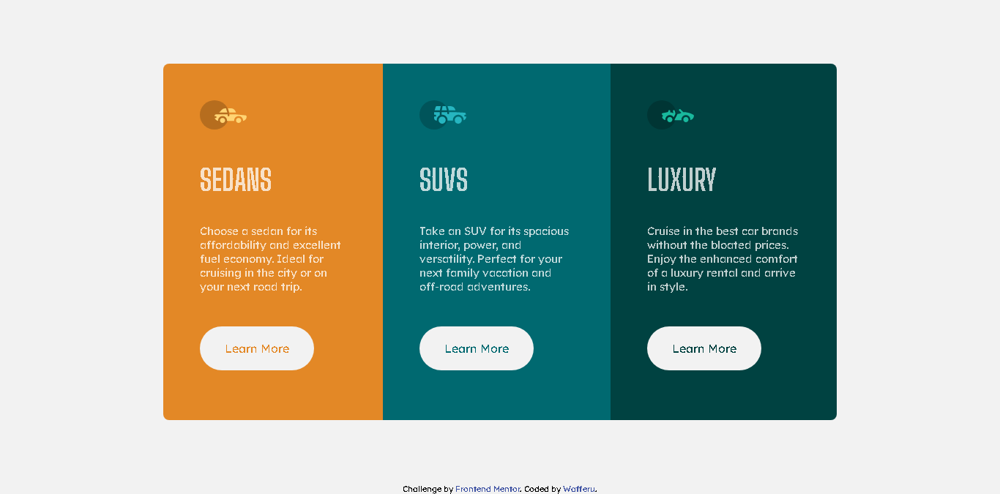

# Frontend Mentor - 3-column preview card component solution

This is a solution to the [3-column preview card component challenge on Frontend Mentor](https://www.frontendmentor.io/challenges/3column-preview-card-component-pH92eAR2-). Frontend Mentor challenges help you improve your coding skills by building realistic projects.

## Table of contents

- [Overview](#overview)
  - [The challenge](#the-challenge)
  - [Screenshot](#screenshot)
  - [Links](#links)
- [My process](#my-process)
  - [Built with](#built-with)
  - [What I learned](#what-i-learned)
  - [Continued development](#continued-development)
  - [Useful resources](#useful-resources)
- [Author](#author)
- [Acknowledgments](#acknowledgments)

## Overview

### The challenge

Users should be able to:

- View the optimal layout depending on their device's screen size
- See hover states for interactive elements

### Screenshot



### Links

- Solution URL: [My Solution](https://www.frontendmentor.io/solutions/3column-preview-card-component-by-wafferu-xsl74oWSPu)
- Live Site URL: [The Live Site](https://gentle-mandazi-fc06f5.netlify.app/)

## My process

First, I start the process of building this project by creating the html structure of the website. After that, I work on the design of the project and tried to design it as close as the expected layout on this challenge. After designing the project, I work on the responsiveness of the website.

### Built with

- Semantic HTML5 markup
- CSS custom properties
- Flexbox
- Mobile-first workflow

### What I learned

I learned because of this:

```css
.threeColPrevCardComp {
  width: 87.75vw;
  margin: 5.438rem auto;
  border-radius: 0.5rem; /* For this one */
  overflow: hidden; /* This one */
}
```

### Continued development

I will continue to improve my fundamentals on my future projects.

### Useful resources

- [Fixing 'border-radius' not working problem](https://stackoverflow.com/questions/10995294/border-radius-not-working) - This helped me for fixing the issue regarding to the border-radius that doesn't working.

## Author

- Frontend Mentor - [@wafferu](https://www.frontendmentor.io/profile/wafferu)

## Acknowledgments

N/A
